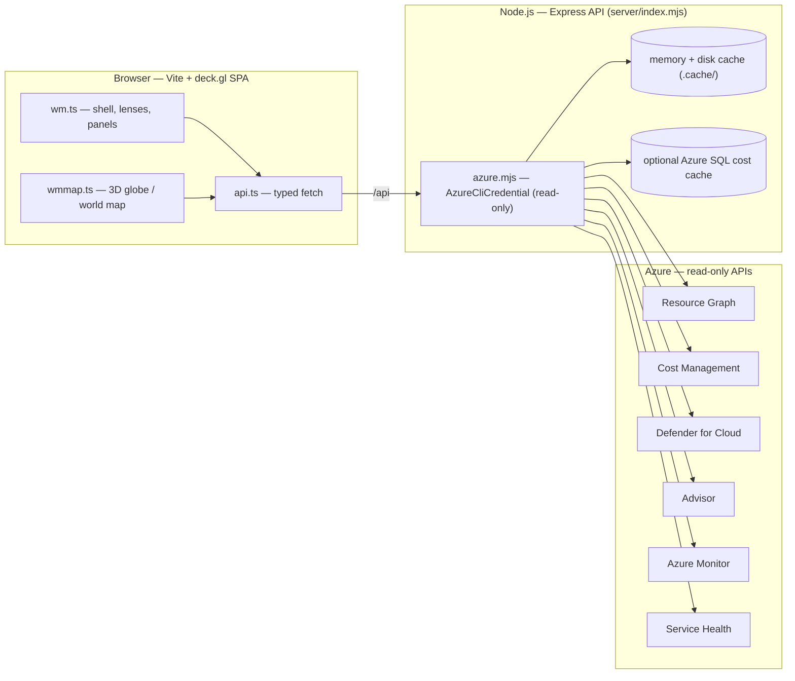

# Azure Infra World Map

### See your entire Azure estate — cost, security, health, governance and reliability — on one living world map.

[](LICENSE)
[](https://www.typescriptlang.org/)
[](https://vitejs.dev/)
[](https://deck.gl/)
[](https://nodejs.org/)
[](https://azure.microsoft.com/)
[](#roadmap)

**Azure Infra World Map** is a real-time, single-pane command center for your Azure
estate. It pulls **100% live data** straight from Azure — Cost Management, Resource
Graph, Microsoft Defender for Cloud, Azure Advisor, Azure Monitor and Service Health —
and renders it on a cinematic **3D globe and world map**. Every region, every dollar,
every risk and every recommendation, visible at a glance.

It's the view an **executive** wants and the depth an **engineer** needs — running
entirely on your own machine, **read-only**, with **no secrets stored** and nothing
ever fabricated.

> **Created by [Zahir Hussain Shah](https://www.zahir.cloud)** — Senior Solution Engineer,
> Cloud &amp; AI / Infrastructure, **Microsoft Qatar**. See [About the Author](#about-the-author).

---

## Table of contents

- [Why Azure Infra World Map](#why-azure-infra-world-map)
- [Feature highlights](#feature-highlights)
- [Screenshots](#screenshots)
- [How it works](#how-it-works)
- [Tech stack](#tech-stack)
- [Prerequisites](#prerequisites)
- [Quick start](#quick-start)
- [Configuration](#configuration)
- [API reference](#api-reference)
- [Security &amp; privacy](#security--privacy)
- [Deployment](#deployment)
- [Roadmap](#roadmap)
- [About the Author](#about-the-author)
- [License](#license)
- [Disclaimer](#disclaimer)

---

## Why Azure Infra World Map

The Azure portal is powerful, but the signal is **scattered**: cost lives in Cost
Management, posture in Defender for Cloud, recommendations in Advisor, incidents in
Service Health, and inventory in Resource Graph. Getting one coherent picture of "how
is my cloud doing — financially, operationally, and from a risk standpoint" means
hopping between a dozen blades and exporting spreadsheets.

**Azure Infra World Map unifies all of it into one living map.** Spin a 3D globe, watch
spend pulse across regions, flip on Danger Zones to see where risk concentrates, drill
into any resource for its cost, metrics, Defender findings and Advisor tips — then
export the whole story to Excel or PDF for your stakeholders.

- **One pane, many domains** — FinOps, security, reliability, governance and operations
  in a single, fast UI.
- **Real data only** — every number comes from a live Azure API call under your own
  identity. Nothing is mocked, sampled, or invented.
- **Read-only and private** — it reuses your `az login` session, runs locally, and never
  writes to your Azure environment or persists credentials.
- **Beautiful enough to demo, deep enough to operate** — built for executive readouts and
  day-to-day engineering alike.

## Feature highlights

### Live world map &amp; 3D globe
- **3D globe and flat world-map** projections of your Azure footprint.
- Regions weighted by **real spend** — neon cost bubbles, glow, and per-region detail.
- **Map modes:** Standard (cost-weighted bubbles), **Heatmap** (deck.gl spend density),
  and **Danger Zones** (risk halos and pulsing rings ranked by cost share).
- **Toggleable layers:** cost bubbles, heatmap, danger zones, **linkage arcs**
  (cross-region dependencies), **availability-zone markers**, labels and graticule.
- Click a region to open its **availability-zone topology** — Zone 1 / 2 / 3 plus a
  regional/non-zonal bucket, with zone-redundant resources flagged.

### Lenses (mission presets)
Switch the entire dashboard to a workflow with one click:
**Overview · Cost · Trends · Waste · Posture · Ops · Risk · WAF.** Each lens retunes the
map mode and the panel wall to the job at hand.

### FinOps &amp; cost intelligence
- **Spend KPIs** — total spend, change vs. the previous period, burn rate and a
  month-end **forecast**.
- **Cost Explorer** — group by service, resource group, location or resource type;
  **daily stacked** and **accumulated** views; **custom date ranges**; click-through drill-down.
- **Anomaly detection** on daily spend.
- **Cost concentration (Pareto / 80-20)** to find the few resources driving most cost.
- **Cost by service / by type / top resources.**
- **Waste &amp; optimization** — orphaned and idle resource detection with estimated savings.
- **Budgets** and spend tracking.

### Security, governance &amp; reliability
- **Microsoft Defender for Cloud** assessments, per resource.
- **Azure Advisor** recommendations.
- **Well-Architected (WAF) scoring** lens.
- **Tag governance / showback** — tag coverage and gaps for chargeback.
- **Service Health** and active alerts.
- **Backup posture** and **inventory composition** by type and region.

### Resource detail dock
Click any resource to slide in a detail panel with **Overview · Cost · Monitoring
(Azure Monitor metrics) · Security (Defender) · Advisor** tabs, plus change history and
Activity Log.

### Stay current
A **What's New** tab surfaces real **Microsoft Build / Microsoft Developer** videos so
your team keeps up with the platform.

### Make it yours &amp; share it
- **Custom views** — build and save your own panel layouts.
- **Export** the live picture to **Excel, PDF and CSV** for reports and stakeholders.

### Engineered for real estates
- **Throttle-resilient** cost pipeline — Cost Management 429 retry/backoff, serialized
  requests, memory + disk caching.
- **Optional Azure SQL cost cache** for long, throttle-proof history.

## Screenshots

> Drop your own screenshots into a `docs/screenshots/` folder and uncomment the lines
> below. (Screens are intentionally not bundled so the repo stays free of any real
> tenant data.)

<!--


-->

What you'll see when you run it locally:

- A dark, full-bleed **command-center** shell: header (logo, lenses, subscription &amp;
  period picker, live clock) → map section → a wall of live panels → footer.
- A rotating **3D globe** with cost-weighted region bubbles and cross-region linkage arcs.
- A **panel wall** that re-flows per lens: KPIs, Cost Explorer, forecast, anomalies,
  Pareto, waste, tag governance, posture, service health and more.

## How it works



- The **frontend** (Vite + TypeScript + deck.gl) renders the globe/map and panels and
  talks only to the local API.
- The **backend** (Node.js + Express) authenticates with your **Azure CLI session**
  (`AzureCliCredential`), performs **read-only** Azure calls, and caches responses to be
  gentle on rate limits.
- The Vite dev server runs on **`:8084`** and proxies `/api` to the Express server on
  **`:8085`**.

## Tech stack

| Layer | Technology |
| --- | --- |
| Frontend | TypeScript, Vite, [deck.gl](https://deck.gl/) (Map/Heatmap/Arc/Path layers), hand-rolled HTML/CSS (no UI framework) |
| Backend | Node.js, Express, `@azure/identity`, `@azure/arm-resourcegraph`, `@azure/arm-costmanagement`, `@azure/arm-resources`, `@azure/monitor-query`, `@azure/arm-managementgroups` |
| Auth | `AzureCliCredential` (Microsoft Entra) — read-only, multi-tenant |
| Optional cache | Azure SQL via `mssql` (Entra-only auth) |
| Data sources | Resource Graph, Cost Management, Defender for Cloud, Advisor, Azure Monitor, Service Health, Activity Log, Resource Health |

## Prerequisites

- **Node.js 20+**
- **Azure CLI** — signed in with `az login`
- Azure RBAC on the subscription(s) you want to inspect:
  - **Reader** — inventory, configuration, health, Advisor, metrics
  - **Cost Management Reader** — cost &amp; spend data
  - **Security Reader** *(recommended)* — full Microsoft Defender for Cloud findings

Everything the app does is **read-only**; none of these roles can change your environment.

## Quick start

```bash
# 1. Clone
git clone https://github.com/zhshah/Azure-Infra-World-Map.git
cd Azure-Infra-World-Map

# 2. Install dependencies
npm ci
# On Windows/ARM, if native build steps fail, use:
# npm ci --ignore-scripts

# 3. Sign in to Azure (read-only; reuses your CLI session)
az login

# 4. Start the API (:8085) and web (:8084) together
npm run dev
```

Then open **http://localhost:8084**, pick a subscription and a period, and explore.

Prefer to run the two processes separately?

```bash
npm run api      # Express API on :8085
npm run dev:web  # Vite dev server on :8084 (proxies /api -> :8085)
```

Build a production bundle of the frontend:

```bash
npm run build    # outputs to dist/
npm run preview  # serve the built bundle
```

## Configuration

All configuration is **optional** — the app works out of the box in read-only mode using
your `az` session. To customize, copy `.env.example` to `.env`:

```bash
cp .env.example .env
```

| Variable | Purpose |
| --- | --- |
| `PORT` | API server port (default `8085`; the web dev server proxies `/api` here) |
| `AZURE_SUBSCRIPTION_ID` | Subscription to load on startup (defaults to your `az` default) |
| `SQL_SERVER` / `SQL_DATABASE` | Optional Azure SQL cost cache (Entra auth, no password) for throttle-proof history |

> The optional Azure SQL cache authenticates with your Entra access token from `az` — no
> SQL password is stored. The schema is created automatically on first run.

## API reference

The backend exposes a read-only JSON API consumed by the SPA. Highlights:

| Route | Purpose |
| --- | --- |
| `GET /api/context` | Subscriptions, default subscription, cache status |
| `GET /api/summary?sub=&range=` | KPI bar: spend, Δ vs previous period, burn, forecast, counts, top service |
| `GET /api/regions?sub=&range=` | Per-region resource counts + cost (Cost Management `ResourceLocation`) |
| `GET /api/inventory?sub=` | Resource Graph inventory (+ linkage references) |
| `GET /api/cost?sub=&range=&groupBy=&granularity=` | Raw Cost Management query (service, RG, location, type) |
| `GET /api/optimize?sub=&range=` | Orphaned/idle waste findings + tag governance + estimated savings |
| `GET /api/region-zones?sub=&region=` | Availability-zone topology for a region |
| `GET /api/resource?id=&range=` | Properties + Azure Monitor metrics + daily cost + health |
| `GET /api/resource-security?id=` | Microsoft Defender for Cloud assessments for a resource |
| `GET /api/resource-recommendations?id=` | Azure Advisor recommendations for a resource |
| `GET /api/service-health?sub=` | Service Health events |
| `GET /api/portfolio` · `GET /api/portfolio-cost` | Multi-subscription rollups |

…plus management-group hierarchy, linkage, change history, Activity Log, resource facets
and more (see `server/index.mjs`).

## Security &amp; privacy

Security and privacy are first-class design goals:

- **Read-only.** The app never creates, updates or deletes Azure resources.
- **No stored credentials.** Authentication is delegated to your local Azure CLI session
  (`AzureCliCredential`). No tokens, keys or passwords are written to disk by the app.
- **Your data stays local.** Live responses are cached only on your machine (under
  `.cache/`, which is **git-ignored**) and optionally in an Azure SQL database **you**
  own. Nothing is sent to any third party.
- **No secrets in the repo.** `.env`, `.cache/`, build output and local state are
  git-ignored. `.env.example` ships placeholders only.

> If you fork this project, keep your `.cache/` and `.env` out of source control — they
> can contain real subscription IDs, resource names and cost figures.

## Deployment

This is primarily a **local, single-user analyst tool** that runs against your own Azure
identity. If you want to host it for a team:

- Build the frontend with `npm run build` and serve `dist/` behind your web server.
- Run the Express API (`npm run api`) on a host that has an Azure identity (a managed
  identity or a service principal with the read-only roles above), and place it behind
  authentication (e.g. Microsoft Entra ID / an application gateway).
- Provide credentials via the standard Azure identity chain rather than `az login` in
  shared/hosted scenarios.

Because the app exposes cost and posture data, **always require authentication** before
putting it on a network others can reach.

## Roadmap

- LLM-backed analyst (the insights engine is rule-based today; an Azure OpenAI key can
  upgrade it to generative answers — the context object is already assembled).
- Budgets &amp; alerting (email/Teams).
- Azure Policy tag remediation and chargeback/showback exports.
- Multi-subscription management-group tree navigator.
- Scheduled Azure SQL / Storage sync jobs.
- Entra ID SSO + RBAC-scoped views for hosted deployments.

Contributions are welcome — see [CONTRIBUTING.md](CONTRIBUTING.md).

## About the Author

<div align="center">

### Zahir Hussain Shah
**Senior Solution Engineer — Cloud &amp; AI / Infrastructure · Microsoft Qatar**

</div>

Zahir is a cloud and AI infrastructure specialist who helps enterprises **design,
secure, and optimize** their Azure estates. His day-to-day spans Azure infrastructure,
**FinOps**, **security &amp; governance**, reliability, and applied **AI** — translating
complex cloud telemetry into decisions leaders can act on.

**Azure Infra World Map** is the distillation of that field experience: the tool he
wished existed when walking customers through their cloud — one place that makes cost,
risk, health and governance instantly legible, beautiful enough to present and deep
enough to operate.

If this project is useful to you, a ⭐ on the repo means a lot — and I'd love to hear how
you're using it.

| | |
| --- | --- |
| **Email** | [zahir@zahir.cloud](mailto:zahir@zahir.cloud) |
| **Website** | [www.zahir.cloud](https://www.zahir.cloud) |
| **Focus** | Azure Infrastructure · Cloud &amp; AI · FinOps · Security · Reliability |

## License

Released under the **MIT License** — see [LICENSE](LICENSE). You are free to use, copy,
modify, and distribute it, including in your own environment.

## Disclaimer

This is a **personal, community project** and is **not an official Microsoft product**.
It is not endorsed by, affiliated with, or supported by Microsoft. All product names,
logos and brands are the property of their respective owners. The software is provided
"as is", without warranty of any kind, under the terms of the MIT License. Always review
what it queries and ensure you are authorized to access the Azure subscriptions you point
it at.

---

<div align="center">

**Built with care by [Zahir Hussain Shah](https://www.zahir.cloud) · Microsoft Qatar**

</div>
